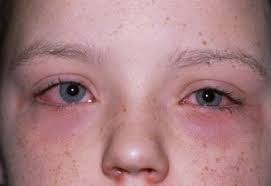

   

## Conjuntivite Alérgica

A conjuntivite é uma inflamação da membrana fina e transparente que reveste a parte interna das pálpebras e a superfície branca do olho, conhecida como conjuntiva.

Anatomia do olho com destaque para a conjuntiva

Diferentemente da conjuntivite infecciosa (click nesse link se quiser saber mais sobre conjuntivites infecciosas), a conjuntivite alérgica não tem algum microorganismo causando uma infecção e gerando inflamação (por isso, esse tipo de conjuntivite não é transmissível). Na verdade, a inflamação é causada por uma reação exagerada do seu corpo a alguma coisa que está presente no ambiente a qual chamamos de alérgeno. Os principais alérgenos presentes no ambiente são: pólen, pelos de animais, ácaros, mofo e produtos químicos.

Paciente com quadro de conjuntivite alérgica

## Sintomas

Os sintomas da conjuntivite alérgica podem variar de pessoa para pessoa, mas geralmente incluem:

- Vermelhidão nos olhos
- Coceira intensa
- Inchaço das pálpebras
- Sensação de queimação ou irritação
- Lacrimejamento excessivo
- Sensibilidade à luz

O principal sintoma da conjuntivite alérgica é a coceira nos olhos

O grande perigo de coçar os olhos, especialmente nas crianças, é a possibilidade de causar deformação na córnea e causar uma doença chamada [ceratocone (click nesse link se quiser saber mais sobre ceratocone)](/ceratocone).

  <video width="400" loop autoplay muted>
    <source src="/videos/cocar-olhos.mp4" type="video/mp4">
  </video>
   
  O perigo em coçar os olhos

## Causas

A alergia ocorre quando o sistema imunológico reage exageradamente a substâncias inofensivas no ambiente, desencadeando uma resposta alérgica nos olhos. As causas comuns incluem exposição a pólen, pelos de animais, ácaros, mofo, produtos químicos irritantes e poluentes do ar.

Ela é mais comum nas crianças e seus sintomas tendem a ir diminuindo à medida que vamos envelhecendo, mas tem pessoas que continuam alérgicas por toda a vida.

## Tratamento

O tratamento da conjuntivite alérgica geralmente envolve:

1. **Medidas para aliviar os sintomas**:  

- **Compressas frias e colírios lubrificantes:** aplicar compressas frias sobre os olhos e colírios lubrificantes pode proporcionar alívio temporário da coceira e do inchaço. Eles ainda ajudam a lavar os olhos e diminuir a quantidade de alérgeno presente na região dos olhos, diminuindo a alergia. Como essa parte do tratamento não envolve medicamentos, utilizamos eles como primeira escolha no tratamento das crises de alergia.

![compressas geladas são bastante úteis no controle dos sintomas](data:image/jpeg;base64,/9j/4AAQSkZJRgABAQAAAQABAAD/2wCEAAkGBxMTEhUSEhIVFRUXFRUXFhUVFRUXFxUVFxUXFxcVFRUYHSggGBolGxUVITEhJSkrLi4uFx8zODMtNygtLisBCgoKDg0OGhAQGi0lHx0tLS0tLS0tLS0tLS0tLS0tLS0tLS0tLS0tLS0tLS0tKy0tLS0tLS0tLS0tLS03LS0tN//AABEIALcBEwMBIgACEQEDEQH/xAAcAAABBQEBAQAAAAAAAAAAAAAAAQIDBAUGBwj/xAA7EAACAQIDBgMHAwMDBAMAAAAAAQIDEQQhUQUGEjFBYXGBoRMiMpGxwfBS0eEHYvFCcsIUI1OyFjND/8QAGQEAAwEBAQAAAAAAAAAAAAAAAAEEAgMF/8QAIxEAAgMAAgICAwEBAAAAAAAAAAECAxEhMRJBBFETFCKBYf/aAAwDAQACEQMRAD8A84uKNADI4LiAAC3AQBAKAlwABRAEABQEAAHAICAYoogoAAALYQCAKAAIAWAAARijoQbdkm30SzDQGMa0dLs3c+vUznamu+b+RuUNx6S+KUpedl6HCXyYR9nePx5y9HnjQigem/8AxDDr/R6tjHunQ/R6s5v5kPo3+rI8uxCfJJ/uQ0KWuf1R6dW3Qo6NeZQxG6Mb3Un5i/agx/rSRxkY2XmOlly5vLwub+I3Zmvhfy/ky8Xs+cG21rna/wAjpG2MumYdcl2jMatfq3y7fzzEUbP6j3JN2+wrprR+KZ0TObiQuXiBYt29QN+RnCQUbcLmjI64XG3C4APuFxlwuIBwjYlxGwAeIIhQABbiAACi3GgADxUNQ5AAqFSH0qbk0km22kks22+iR6Rux/SmtU4amLl7KDs/ZxzqNaPpH1FozzWwWPp+O7uE4FT/AOmo8KVrezj08haW72Eimo4aik+dqUM/QfIHy+o3yWb7Gvgd18TVzjTaWs/d/k9r3ipYZTjTp0qftVm3GEU4x0ul10IadLLQktvcXiKaqFJazzfA7hPnWqeUF92dNs7YdKj8FNJ/q5t+Z0zoDJUCac5y7ZXGuMekZsadiSKJ5wsRSRxOqGSIXT8yWUgMjKs6TKlagbKgRVKaE0Bz9SHYpYihGSs0dBXolGrhxJ4Jo4jamxU7tI5yvhXD+T0zE4W5iY3ZildWz0Kq72uzhZSmcRxv+31+whs1Nkyu/i+SAq/Mib8TMviC5FxC8RUSklxLkfEHEAEtwuRqQvEAD7iXG8QlwAkTFuRqQqYASIciNMfFgA4AQohipEtKk5NKKbbdkkrtt8kkFCm5NRirttJJZtt8kke6/wBPtwoYWKr10p4hpNJ5ql2j/dqw0Cr/AE43AWHUcViFes1eMHypX6vWdvkejJAguNLAFK2PxKp05S0T5k05pczkt6cRKuvYQyUvjlpHqlq3yMzsUUbhFyZhbuUpVJ1MTO/vybV9L5en1OloYdydlcj2fgnZQiskkl4dzpMHhlCNuvVkcK3ZLfRZOz8UcXZBDZcbW66lDE4Xg+Ll0fTz0N4bOCas1daMplRFrgmjdJPk5idFXKdWijX2jgZQvKF5R6rm4+GqMr2iayIbK3F8ltdikuClWhYgcc8mXKjK04nBo7piRnmOlIiaHQf+DIEdWJWnTLkmQzDA0za1EoV6X52NmqjPrLMWYIzJYdPO33AsezAYsR5LxhxlfiFUj3MPGLHGHEV+IOIeAWOIXjK/EKpCAscYcRApCqQATqQ5SIFIcpAMnUh8WQJmvuvhfa4uhTaunUjfwWb8shN4tGlrw9L3V3DoxowqV48dSSvwv4Yp8lbr5nQYjYFKKt7OCWnDH9jUo1rXy5ZLsSe2T7s857LnT1IxUFmHM0NmwpVFVpwhCcb2koRuvDI1YbfxC/8A0v4xj+xHi3npmUJZsxsl7NOEH6NqO8OItzi/GP7Ei25iH1j5RX3MWmWqaY/Of2Z/FD6L08XUl8U2/T6FnAYZzdl59vEiwOz51HdKy/U+X8nUYLCxpxsvN6s61VOb2XRxtsjBZHsMHhlBW69WWAA9BJJYiFtt6wAAGISxz+3Nhyb9rh7KefFTeUamXR/6Zd+T66nQgZlFSWMcZOL1Hm9LF3cotOMou0oyVmvFeI5s6zeHYUa8eKPu1Uvdl0f9s11XqvQ4dTnCTpVVw1I80+q1T6o866lxPQpuUuC0IJcRslwoFuRtiQnfkRSXP0AQytcpV+RbnkUmgAquLAdKLABnitxeIjTC57p4hJxC8RFcW4AScQ5SIri3EMlUhVIiTFTACZMkiyCJ0G52788diYUIZJ+9OXSEE1xP9u4mM0Nz9y8Tj5L2ceGle0q0vhj2S5yfZHumx90cPs/CzjSjebj79WWc5Px6LsjXw0KWGpRpUoqMIRSilourM/aGP448N8n9s/scLLElyd6qpNpnP7W2oqNPitxNvJatjdnbR47XXDKydk01bs0R4zDKrDhllo9NDLq0ZUovOzVrNf2vrqSxPUceDpMfG/v9Xz8TKUy3sfaEcTQ4481dSWko5SX0fgUMWrMxLsSWo08DQc2kldvodRs7YajaVTN/p6eepU3LnF020lxKVm+tunkdMVU1Ra8mQX3STcUJFWyQqG3HIqRIKAAaAAAAAAAAADG3h2HHERTXu1Y/BP8A4y1izZEZmUU1jGm09R5a1KM3TmuGUXZr7rVEkpf5Ow3o2L7aDlBJVYr3X+pfpbOGp1btpqzTaafNNZNNeJ5dtXgz0qrVNC0KXDfPm7klTULjakjlh1b5IKhXquxMyvUWfzFgEUmBFJAAHiYCge4eMAAKAAKgsOSEAg5AkPUQGEUeof0WxrpTr/8AaTUoxvVeVrP4F43v5HNbo7qPE2qVLqnfJLJz1s+iPUMDs2NOKhTSjFdFZIluuS4XZVT8dvl9G/Vx3G85LwWflkR1ZKVuiv8APsV4YeHKzT1X39BV7rs8/Egk3usvSxYiSrTMraeFlKlNL4rOxqusQTq8OfNdTcZHSP0cb/S51YVq8JpqNlJp9Jp2+j9Dqtp5XLkMTBLJJX+ZkY+s5uy6jnLy5CEPEtbu7QlSmpr4eUlqv3PTKVRNJrk1dHmWDwtlb5nYbubRVlRnlJfC31WniiiizH4si+XVv9I6AUQUtSPPAAAYAAAAAAAAAACMAEZym9e77n/36MV7VfFH/wAiX/I6mbI51FzZynBSWM1CTi9R5VDEpu3Xqnk01roOlIl3zrUpYlOglxpP2jXKXKza5XKsGebJY2j04vYpjkypiJWTLMzKxtbJ+H7CzR7gntl1Ayq9b3nkA/AXkjy9DhEhx655IlgsLYdYQCIckCQ5IBgkbO7exJYipbNQjZzlor8r6s6bdjcPjgquJuuKzjTWWXTier0Otp7D9jSdOklGF7tJde7fP1JbfkJcItp+JJ42LCKpwjGCskrJLos0vzuXsHjHdcVy5u7gsPO0a0m59VL3U/8Abr8zo9obChUSjTSil1S9ETxg5LUyyV0IPxaMNVL8s3ll87/YdUjeKl1RWr4aVCThLvnqi5hpJprVev59RSjqHx2iuER/BkCgcBpkEsIv8C08FnkvMsRZcoINNaJh8NYfVoXeWTX5zLCuKomuhMu7M2u4tU63lPX/AHfubyZydSlxKxYwOOlR92V5Q9Y+GvgWU35xIhu+PvMTpQGUqqklKLunyaHlpCACAIBQABgAkmFynjMSoptvIy2AuIrpK7Zwe9W9Lu6FFvjfOS5RWr79invFvNOrN0qDtFZSnp2jq+5i4XDKPLNvNt5tvuya2z6K6qfbH4elwrV9X1bLEJZsY100HJERZ6ExFTU53FV9fzN/wbGPnk9fz7nM7TnZ+h0gtZzk+CNzl0QFZYjv9QO2HHyOJQAOLSEEhQiPsAwSOh3J2V7fExTScYe+73tk8vUxsHhZVJxpwi5Tk7RS6s9u3Q3djhKKjk5yzqS1louy5E99ijHPbO9FblLfovUqlsmrMvQX4vs+gk6CaeRClKPgQRf2erpFjcOmm8o+Xb65lvYu250LRqtyhkr83B9E+w2L4k+mitydrIz9o03z6205N25L85ndR8f6iZlk14yNvbsnWjxxtZe8tX4GPsereSXfXkVsJtN07xd+DvzXloylgMUvaJpNJ5pNNPn1XQcmn/Rzri47F/4dRKNm15ZjLXJ6iUnxLqNUDhJcm4jFDMt0SFRJqZzzk3pYgPiNgKdEjDHpq4s1dEUrDlIaE0SYPEui+ri+a+67nQ0ayklKLumctVqZE2y8b7OVn8En8nqU025wyW+nf6XZ0wCJjZzKyEc2I5ledYyNsbahRi5SkZchpaamNxsYRbk7Hm28W3Z4h8FNuNPldc5LtoR43bNau3/pj0/V49iPDYPq/mT2WlVdOPWVsPhUklFWRacLIna6IikiaUtKksIGhvFYkZBUl0MGipi+Tb0v/HyOW2nKy8LfU6TakvcfhY5DatX4vG3yKKlycbXwZ8m9QK3Gvz/ApV4knkY4qAdFHU4CpGhsjZNXET9nRg5Pq+kVrJ9EaG6G7FTG1LK8acf/ALKmn9sdZP8AO/uGxdi0sPTVOlBRS+besn1ZPbco8Lsppoc+X0c9uhudDCR4379VrOdvhX6YLou/NnVQp6ll07DZQIJNyes9GMVFYhkYiSgSISRlDKsqenPVDakIy+JZ9WuungWbEcoHWM2jLMHH7NtnHPTK/YxpRlGSbXJnZzpFKeDTvdfMTY1J4Wtl1rxXgWyvs/D8C8izIXZlPGIx8COKuS0ww1pLFkiIU8x6loaQmKxrsh3GRVZI1gtGTlncjqizkQVZZGRnQ7Cx/FFwk848u66F2vWS5s4uniZU5KSfLn4FfbO1qtZuK9yGi5y8X9iqNv8APJFOhuXBpbZ3nUW4Ulxy6tcl5nK4hTrS45u/bomT08LbsixGKscZ2NnaFSj0R0aFiew2LCRxb064NkV5SH1J52KtWZljwJzK8HfMdORD7S1xoGyltqpaD836/wCTjNpO3q/P8Z0W2q900+v5b80OSxtXib8PrZ39C2iJJczLxNZ8Ttyy6dgIPbdwKcJNFRJTjd2Su3klrfkiNGlsBL/qaF+Xtaf/ALoHwhLs953P2PHDYeFJLNK8nrN5yfz+h0MUZeErmhSqI8zvs9ZLFiHtDGsiUjkhYaIuEbU7j5MjmzODI7i3uKxqQ0JhYRwHRY/IeGdCKEkiVRCQ8EiGWQUxZIQEbHqQqGjrGkLRINruMmSP1IpdxgQcWbQypLJ3/Ow6M0721ImzAeyDO12RJK5LVmivyVhaA92GXG3AQCjJTCTK9WQhi1JFWoySq+5VxFRJfmgYBFXrpGRjcfnz5cyDH4sxcTiPU6whpwnPB+OxN0232/f6HO42eT/Mrf4L+Mq5dvz88zFxE8mvD6ci6uOEU5aVpPMUS1wOpzLKJaNRxakuaaa8U7kSHIQHt+72241qUKiebXvLSXVPzOloYi54Ju9tqWHnrCVuJfddz1LZG2YyinGV4vk/3ILa3F/8PRpt8kdtTrEsZmNRxN1zLcK5zR2ZcsRSD29xHMbQkxsgTC4IxgNjkh6QxD1I0IKjdsufQZTbaz59R1xQAaNnEWcsuQOQGiSwkUIDdgEDKtWN82TSehUq1LjYIZKSWRDUqC1J5FSpIyMdOZBUmR1KhDKRkCxxiuZVUh6kMZNJkVRhKZFOoJgRVJGdtGp7rZaxEjP2hL3bBFcil0c3tCpn2/ky6s+f5l+MubSnZX8frmYs63f8yLoIhsZFi6+VtTOqSuWMU+T/ADVFWRRFYTsQAAYi4mKACEOTNXYu2JUJdXB/FH7ruAGZJPhmoyaeo9I2ZtfJO90809Ub+HxtwA858PD1E+C5DEXJ4VwAAJY1CSLEABD1MdzAANIVMcwAENiXETuKADFjIZOWgoD9GEVqk30Kk8gAyMr1ZlStIAEMrTlmQSYAIATHcb6AAAK525kFSoxAACtWlqyhip3TADUexS6Oa2rTfLt6/wCDlsQ7MALqSC0ZOfEvkQsAO5wBRAAAD//Z)

- **Uso de colírios antialérgicos:** colírios prescritos pelo médico podem ajudar a aliviar a coceira, a vermelhidão e a irritação nos olhos. Os colírios mais modernos atuam tanto para eliminar os sintomas como também ajudam a prevenir o aparecimento de novos sintomas (por isso, às vezes utilizamos inclusive fora das crises).

- **Medicamentos anti-histamínicos orais**: em alguns casos, podemos prescrever medicamentos anti-histamínicos por via oral para ajudar a controlar os sintomas.

- **Colírios à base de corticoide**: em alguns casos lançamos mão de colírios à base de corticoide para alívio dos sintomas. Importante ressaltar nessa parte  que esses colírios geralmente devem ser usados por poucos dias, pois o uso indiscriminado pode gerar catarata e glaucoma (especialmente nas crianças, esse tipo de colírio pode gerar aumentos muito importantes da pressão intra ocular). Portanto: siga a receita conforme indicado e jamais se auto medique!
- **Colírios à base de imunomoduladores**: em alguns pacientes mais resistentes aos tratamentos convencionais ou naqueles cujas crises são muito frequentes, podemos utilizar esse tipo de colírio para ajudar no controle dos sintomas.

![diferentes tipos de colírios podem ser usados no tratamento da conjuntivite alérgica](data:image/jpeg;base64,/9j/4AAQSkZJRgABAQAAAQABAAD/2wCEAAoHCBYVFRgVFRUYGBgYGBIYGBgYGBESGBgSGBgZGRgYGBgcIS4lHB4rHxgYJjgmKy8xNTU1GiQ7QDszPy40NTEBDAwMEA8QGhISGjQrJCs3NDQ1NDQ0NDQ2NDQ0NDQ0NDQ0NDQ0NDQ0NDQ0NDQ0NDQ0NDQ0NDQxNDQ0NDQ0MTQ1NP/AABEIAL8BCAMBIgACEQEDEQH/xAAbAAABBQEBAAAAAAAAAAAAAAACAAEDBAUGB//EADwQAAIBAgMFBQUGBgIDAQAAAAECAAMRBBIhBTFBUWEGInGBkRMyobHRQlJicsHhBxQVwvDxgrJDovIz/8QAGgEAAgMBAQAAAAAAAAAAAAAAAAECAwQFBv/EACYRAAICAgICAQUBAQEAAAAAAAABAhEDEiExBEFRBRMiYYEyIxT/2gAMAwEAAhEDEQA/ANnLFlk+SLJOfsbKICkbLLBWUv6th82T29LNe1s6b+W/fJRUpdKxNJExSPlkxWICKw1IcsFkli0YiFhqVvZxsksEQbQsNSH2cXs5LaK0dhqReziySTLFaFi1AyRZIVorR2FAhY4WOBCUR2KhKslVY6LJ0SMCMJCCScU4YSBEhVIYpyVUhBJJBZGEhhIYWEFjojZGFj2koSEFjoVgBZLRWILJ6a6SSQrHjxCPaSFY0UeKAWc7GMKMZgNtHH9vqj5aa5wlN8+e+ezOMuVWygm1iTa1tJw1aulgtl0JPcz635ltw04Cdf8AxIxWlKkOOZ2/6r/dPPGGs9D4DrCrXyYcv+mesdktsJUpJTY2dVygH7SruyniQLXHSdDaeM7LxhUhCbC4ym9srePDXjwM9P7ObRatTIc3dDlY8SpF1J67x5TJ9Q8L7f8A1g+H3+rLcOXb8X2a9o9oxiBnJs0UMwgkQngmMKGjExGCYCETFeCYowCgxo14xBQ1kYkiySEyemJapCV6ctII0QZMEjhZJT3RWk0iDYIWEFjgQgJJIVjBY4SGBCAjoQIWPaFaICMVjASZRAUSUCSSAa0e0eKAhrRR4oCObiMOCZzzoHm38RcOwro/2GSw6MpII+IPnOKYz1jt5g8+Gzga02Df8T3T/b6TymqJ3fDy7YUvjgw5o1JsAPOv7EbSyVgrHuv3D4n3T629Zxgl3A1SrDWbZJZccoP2Vxeskz3GNKeycb7akj8SO90caH4y0Z5eUXGTi+0dFO1Y5MBoUgq1kU2ZlB6sB84lZGUlFW2EYxiDctY0YxRooxMBCiiJjXkgHvJFkV4aGSRFlumZcpyjTaW6ZkkQZbptJnHGVllqnqJNFbAEMRssICTQh4QjBY+WMQooQWICOhD05LAWFeADxRrxSQhRRjFADAjGDHtOYdAhxVAOjo251ZT4EWniWOw5R2RhqpKnxBsZ7TtDEezpu/IafmJsPiRPH9sVA7lrm51JO8nnOn9PUqb9GbPXBjOIdNrGKoJHedbHKmZWjocHtBkylHZGF7FSRytcbiPGeh9ndrnEIc9g6EB7aAg7mA4XsfSeS0GJBFr2sT0F51HZbaIo1QWPdayv0B3E+BsZX5vjxy420uV0XYptNX0d/tOuyUnZdCALHTS5Avr4zlVRszLlUsA5YswNgoJYgk2JsDz13azU7TbTVUeitiWVgx35bjQDr8pwjVWtvnHwpxVtHO+oVlyJRl12dtsHHqMyMwA0YEmwHAjXym8hvqNR01nmuAqEsBzsPWb2BxzUn7rZkvYjgedhz69JKWHb8kHj+b9nXHJcL2dc6WkZEkZwQCNQQCPAwTMh2+wMsa03tm7KQoHe5zahbkADhe28yxitkIynIMrW0sSRfkQZkfnYlPTn4v0FHNWhoJHJFm5EWWaUu05Rpy5SMkiDLSyxTaVkMmUyaK2WnTjAEkovdSJEZYRCijAwrwQDiOIMe8Ygo94N4rwAK8UGNeSEFeKDePIgYURMYxiZzzeUtr4c1KLovvFbr+de8vxAnkWJoZze9t+/W3RhwntInj/aLDvSr1FYEWc2YXAKtdkN+dviDOl4E+4/0z549MwaykGxEiCmWnqsR71/jKzN1nStGcNamXdLWDYkEczbnpxJlG0u4WsVUoDoxUtu1K3y69Mx9fCWRyeiLR0TVC92Ykk6knW5lSpR623aawaGIyix1htXWcyaptHKcZKTARQLWJ6359Okv0altT5btTM1q44dY61iTIJ0KUHLs9G2FXz0EPFbofLd8CJr4PCNUNl0A3sdw/ecZ2UxRDFL6ML2/EvH0vPUNmIFpLbiMx8TOT9QzPDG12+ju+FP7mJfrgz02t7AmmwzBTZSdDbheUsZ2kLd1RlB3nebQdv4ZsxcDQ75zWVi1us4sFs9m/2dOMIr0d1V2QjqGTukgG29SbX47pilCpKkWIJBHUTd2VjGyKDw0PXlpKG2mBqXH3Vv4/6tOp4udylo3aM84NcldDLdMyihlbaW1xS7qjM5G7go1sTz8J0bS5ZHFhlmkoxVss7d2q1BVCAZ3vYnUKotc24nUTnV23iQb+2POxVLHpbLMva23HDqzFXIzd0qCoB4W4cDM4bZAIOQXFjrYjT9JBtydo7/AI3j4sOPWcU37bPVezW2DXQlgA6ZQ9txuNGHLcdOk2qw1vPOOxm12Y1WCLqad1WyAC7WyljYbzvPEbp6LhKy1EzKb+lweR5Gao3rycDzMKjkcoqk+gbwgZGY4kjISAx7wBCgIIGK8GKADxRo4gIUUUUkBhRiYrxjOcbxwZw/8QsBcLWHHuMOo1U+lx5CdtMvtBgPb0HQe97y/mHDzFx5yzFPSSZGcdo0eNOgkTWG6XsfhzTdkYWKkqRpoRod3WVchY6TqrLFq7MmruqIQZOhjpheZ8h9ZapoB9kfOQl5Kj/nkmsEn3wS03uo0GmmnHUm55nX4QSZpbD2YKzuuYgBb87MTp4jQyTGdn6yX7mYfeWzfDePSU7bcmDNhcZN1wZF4dMy1T2TWbcjeYy/Eze2P2TZiGqkBbjug6kdTw8oipY5S4SNTsJsh6meruVQVW/2nNrgeA+YnbbN2kqj2T90jQE6abyOm74y3sVEVAigIFHdA0FpyW2nvVqdHceQ0HwnO+q44yxxfuzq+FDROP8Af6dhXTMJkvs4A5gJzNPa1RRYMbd7jfeJFitsVW0zm1xu04dJwo+PK+zoqSOhrbVSkCCbngBrvvbylPB4lqgZz9656A7h4bh6TkXqG86Xs411cfgPqNR/1m/BBY5JilzFmmhnHYioztmFyXswtrvF+E6rEVMqOx0yo59AZxuztskUTR0V7jK+4lLNdM3AfUzpyVmr6XLRylXwjI2jcteZrmbGIW8oVadybDnoN3lJR6N2dW7RpdmtoLSYhwxU/dNmBGuh4X3X1tfcZ3PYja5NdkLEq4JGYm+cC9/GwPpPNaSWnWdgnzYsAfZSox9AP7pcpdIxZ1H7Uk/g9WrjWRiCWjiWHnw7wpSxe0aVL/8AR1U8r3bn7o1nE9o9ufzLtSpPZEC6arnYnVrHloLHqZKMW2SjFs9CRwdxB8CD8o88owNRqT3zurAG2Un3rjQi+6156PsPH+3oq/EFkbh310J+UlKOoSjRoiNFFIkBzGiigBgxGSIhMl9hz+U51G8qkQDLbpA9neFAeb9sdiMrl0UsrXJsLlTx05Tn9k4RarinmCFs4U2uDUCnIp10zMAt+F56ztPDEoeY1E5A00Y6qCRYqSov01PEWl8XcaK29ZWcapFr3Ejetymzt7ZyizooQXswAsNdxt/m+Y2ZF6n1jSRLZtfB1HYXfUvvJU/8bafG87ZV5zzfYO0kp1abAsWcujpayqpK5GzfaJ72nDSeio4IBG4y1PjkpnFXwyVaV9Ao8LCTCmRv0kIxJGg08IPtTFbFSL6PbjMvE0w7uCbMcpW+4i2o8YqmNG5dTz4D6wcah0ca2FmG/SZPMi54uPXJZiajIxcQhU2It/qVH+k1KlUHff4H5ys+XmfQTlRZqM5k19Z0nZ1e8EG9tPXSYLG50nU9nsMaffbRrHKOIvxPWa8MHOSITnrFlDtWSmGcfipg+GcftPOnM9d2hglro6PoHQi/Jr3DeRAPlPKMdg3pMyOLMpsf0I5gjcZ0XGmafEyLRx99ka4phpe4666Rv5o8hK5P6xoJI0PLImesT08NJ1n8NqgXFa371Oog3b+62vSyGccDO9/hpstmqNiCO4gZFPA1GG4eCk3/ADCSS5KM8vwbl8HpYmF2s2wcOiqhs75rH7qC2ZvHUAefKboM847Q40YjGVEB9xMia72QkvbzLekuiuTjxVsxMRjSLsSSx3kkkk8yTMOpWN819ecvYpDMutLmWNlj+q1bWznx0v6z07+He0QMOtNuLuQ1/tMdzfWeSAzpOz21DT04co4pSdSK5Wz2sxXlDYmL9tQSpxZSDu1KkqTp1WX7SlqnREV4ojFIgZy4i25RfrAfFt09BKt4iZgs3EjVyePwEDPIzFCwCqPecxtLD5HNtBqRysZ0h10i2ns5Go2Y5X3obE+IPMSUXRGStHCY6jnRk5g2PI7wfW04KqzFiWJLXOa+/NfW/nPQ8Rh6yaezzjddGX5Na3xnN4js7iKtRmFMIGN+8y6c91/GaISivZS4y6MBGtY3sQQQeo3T0vZeOJRNCCV48xwI8CNZnbI7KJTIaoc7jUC1kB8OPnN3HYUixK691gDocvAjlcRPIm6Q9GlbDbaH4dfHSU6lZm3ny4ekjq6MOUixBNwBm14i2gv1/wA0jETisF6ngo3mbuAqZ0U6XtrbUXnJI5zZW01UHvAC5A0LHU7twE6DA1wjZSLBhcWG4jSFUBar4FG3ix5jT9pW/pS/eb/1+k0jiE+98DIxiU+8PQ/SVPDjbukSUpL2Q4fCImqrrzOp9eEuB8oudBIMTtSmq2W7Hwyj1P0mPWxrObnQcANw+sshFRVJCbN7DVy63txbToCQPlKm29jJWAD6MPdYbwOXUdJFsbEgi24gsbdCxmxVa8sCEnF2jzfH9k6qaoVcdCVPodPjKC9m8Sf/ABHxzJb5z05ljZItUaP/AFS90cdsbsUzkGs4Vb3KpdmI5FjovkDPVNnUkp0RSRAiJ7qjQDifEm5N+swaGhmh/OZZNUuijJOU+2a+Fpi4LC45brzwnbdRqWMrFSVIrVWU/hLkj4Ge1nGdwEcRPLe2uzC9RqqC5vdhzjjLkhVIyWxS1NRYNxXrre3MaGVq+GuJlMSDxFv0/wDn4ywmMcaXv4+n1lthY5wxvJqbZdTIv5xuQH+fv8Jo9m9lPi8SlIAkXDVDwSits5PLTQdWELoiz2bs7hDSw1FG94Ipb8799vixmkyRO/KJW5yplYAUmKXkemBcnyijA5KKIiITnHQFHtyPzjSfD0G98fZ18v1ggJcPSyDOw0G64MoYrEF2ufIS1jsc1Sw0AHLS/WZzQb+BL9jbRwmR7bwQrKeaMLg/p5Sk6zUxNfMiKRqgZc196k3AI6a+soOsGC65K0desJhBghsGpg1biQfWVnwDjdY+dvnL6tFeWKbK3BGcuyVLBnA8Ba5/MeXSW8StwCBuPDgCCP1khMdTzj3basNUkVkNxITVUi4Yeo6/Q+ks18NYHip4jTjeUamGvrmO7krc+Y6/ASwqI6lZb2vc9LmVhmdgLW3H/fXQ6Sw1DmSfRR6C0t4DD3N7d0b/AKR2FEKKUcEG1uvkJt4evnHUbxMnbYFi3QbvH9pUTGMjgA/ZB65tSRyOnCSTtC6Z014StMhdq/g18dPlI32i53EL4b/Ux2M3XqBBdiAOszv6gGL8Aq92+8sXVd35Sx8pk1q3F2J6kkwKbX1B+18gfrFYjp6GKuLcpQx6XPjIcJiOPiP0ljEsGFxAdnNY/YSObgWPT6TJq9mHHut6gj6852tGncyZkj2aFRxGG7LOx7z2HQePPxnpfZTCJhaeVBq+rsd7cBc8hymSqy+lSwVRvNgPEyUZMTR0oeMWgxAyRWOYoBMUiBmBZKlEnd/gk2Hp5mCjcSFHhuv+s63DYNUFgB47yZjhjcujXOaiclRwlzroOsjx9cHurYAb7cTNvb4VbW0J3zmahuSZGS1biOL2VgGAy6X6w4zn4gfC1/lETISIBEkMFhACq6wDLDCRusBEYjyZGXIRbv5gQ34bEEetjICYxijiNGvAC1QvY24bx0kD0UJ3EeBjCNeNSaIuKZLSwSanKTb7xAHpxiL8B6DQSO8aPZsWqQOIo51PEi+m+44iZFWmc17grbQa3Vt2nxm4ptDemj+8oPXcfUSyEvTISj7Odw4PHf8AvAzsbFQQNNCoB56knpbzm3W2UN6N5N+hkKbNqE2y+dxaTshRnU8OW3/O59dw8pexWzzSyC29CxH4ix09LTc2bssJZnOZuA4D6xu0VMlA66kaHwO79fWMRy+HcqhY9Tw+Hj+st0sUpUEmwPj5ylWbMpyi4zWI3aDfbztJNFAXXgBfS/nz9DyghGyj2ETVhMvCUgg0vrY6n9OEKsz27pAPMgkegIg2SLrVppdn6edy51C6D8x0+AvOeRGI7xLHkLrfxF52uzaHs6arx3t+Y/TQeUcSEmXSYN4JMYmTIhFooBaKAEeBJBBvu1nQjbK21GvjpOYevwG6RGrMSk49GuUFLsvbQxZdiSf2EzmjM8EtIk6GEYxEwSYACTGJjtBgAxgFYccCCAiZJE4lppERGBWMQEnKwCIADGhQYCFEIxjrAA4aGRx1kkRZYRpZptKaGWEMmiEi9TMkdAwKsLgixHSQUZMssRUzlsfs9qR3XQk2bx4HrKCMxaxQgC3e0Icc+YI5HxndMgIsRcHeDqDM+vsdD7pK9PeHoY6BM58f5wletWtw5dBN47Eb749DDw+wUU3a7H0+O+Ciw2RW2Dgy7Z390WIH4p095FTQAWAsBy0hXliVEG7CJjZoJMEwAO8UjvFEBn5orwYphN4948C8V4APGYxExjABiYEKSUjY3sDbcDqL9RARFCUcJarYtmBVrG/QDXhulMRgOFvxtBq6HSSlrDdK7QAEmKK0aAhBIzJCETGAERWNaFeK8YCAjDSEDCtGRHVpPTaQBJYpi0mhMtUjLCmVqcsAyxFTJAYUFYcmisGICFHAjAUYmOYEYhXiMQiMAGMURiiA/9k=)

2. **Redução da exposição aos alérgenos**

 Nesse ponto gosto de chamar bastante atenção dos pacientes e dos pais. É muito comum recebermos pacientes que estão buscando uma segunda, uma terceira ou até uma quinta opinião sobre o tratamento e reclamando que os tratamentos anteriores não funcionaram. Na maioria das vezes identificamos que eles fizeram a primeira parte do tratamento com medicamentos anti alérgicos, mas não fizeram a segunda parte, que é reduzir a exposição àquilo que esta desencadeando a alergia.
 A alergia é uma doença crônica e não tem cura! É isso mesmo, os anti alérgicos vão melhorar os seus sintomas, mas não vão curar sua alergia. É preciso descobrir quais são e evitar a exposição aos alérgenos! Essa é a parte mais difícil do tratamento, mas a que vai dar maior resultado.

- **Descobrindo os alérgenos:** Tente identificar quais são os desencadeantes. Os principais alérgenos presentes no ambiente são: pólen, pelos de animais, ácaros, mofo e produtos químicos. Portanto, tente identificar onde você estava quando começou a crise de alergia. Foi no banho ou após ele ? Será que foi algum shampoo ou produto que usou no rosto? Foi após a alimentação? Será que foi alergia a algum alimento?  Foi quando visitou um sítio que estava muito tempo fechado e tinha muita poeira? Foi quando visitou a vovó que tem aquele cão ou gato? Esse é o jeito  prático de descobrir os alérgenos no dia a dia.

- **Teste alérgico com alergista**: quando não foi possível identificar o alérgeno, pedimos ajuda de um alergista que, geralmente, aplica os testes alérgicos para tentar identificar o que está causando a alergia.

Uma vez identificado o que está causando a alergia, você deverá tentar manter-se afastado desse ou desses alérgenos para evitar novas crises. Sabemos que isso não é fácil, pois é difícil controlar os ácaros e poeira, é difícil ficar longe dos animais que tanto amamos, às vezes alguns alérgenos estão presentes no nosso trabalho, como produtos químicos e sabemos que não é fácil trocar de função ou de emprego. Entretanto, precisamos saber que nos afastar dos alérgenos é o principal tratamento.

Quando não obtivemos sucesso total com todas as medidas acima, pedimos novamente ajuda do alergista (é muito importante o tratamento em conjunto) e ele utiliza as vacinas ou imunomoduladores orais para tentar ajudar a manter os pacientes livres dos sintomas.

## Cuidados gerais para alérgicos

- Cuidados com a higiene: lave as mãos com frequência, evite coçar os olhos e troque as fronhas dos travesseiros regularmente para reduzir a exposição a alérgenos.
- manter as janelas fechadas durante os picos de polinização, usar capas de proteção de colchão para controlar os ácaros ou limitar a exposição a animais de estimação.
- realize semanalmente a limpeza do filtro externo do ar condicionado ou dos ventiladores e faça a limpeza mais profunda conforme indicação do fabricante.  
- Use óculos de sol  ao ar livre para proteger os olhos do pólen e da luz solar.
- Use óculos EPI no trabalho para proteger os olhos dos produtos químicos voláteis (também ajuda a prevenir os acidentes de trabalho)
- Mantenha as áreas internas bem ventiladas e livre de mofo.
- Use um umidificador para manter a umidade do ar dentro de casa em níveis confortáveis.
- Prefira passar pano úmido ao varrer a casa para diminuir a poeira em suspensão.
- Prefira produtos de higiene sem cheiro e produzido com substâncias hipoalergênicas.
- Troque regularmente os travesseiros e colchões (conforme a recomendação do fabricante), pois eles vão acumulando ácaros com o tempo.
- Lave as roupas que ficaram muito tempo guardadas antes de usar.
- evite animais domésticos que soltem pelos, especialmente no interior da casa.
- evite ao máximo tocar e coçar os olhos (tente usar os colírios e compressas prescritos). O ato de coçar vai ajudar o seu organismo a liberar mediadores inflamatórios nos olhos e piorar muito os sintomas.
- Faça visitas regulares ao seu oftalmologista (evite ir somente nas crises) levando sua receita e os colírios em uso (apesar de nós termos isso anotado no prontuário, precisamos nos certificar que vocês compraram os colírios corretos e que estão usando corretamente).
- é muito comum que o paciente com conjuntivite alérgica tenha outros tipos de alergia tais como asma e rinite alérgica. Para um melhor controle da conjuntivite alérgica, é muioto importante que o tratamento dessas outras alergias esteja sendo realizado corretamente (seja com alergista, pediatra ou otorrinolaringologista).

Por fim, gostaria de deixar o recado de que entendemos o quanto é desgastante e frustrante conviver com doenças crônicas que não tem uma cura (especialmente para os pacientes com sintomas mais graves e frequentes). No entanto, não perca as esperanças e tente seguir corretamente as orientações do oftalmologista e do alergista, use corretamente as medicações e vacinas porque, em quase todos os casos, é possível obter um bom controle e manter uma ótima qualidade de vida.

  
  
    

 **Veja também**  

  [Como escolher a lente intraocular](/lentes)  

  [Catarata e Cirurgia de Catarata](/catarata-cirurgia)

  [⇦ voltar a pagina principal](/)

----------------------------------------------------------------------------------------------------
