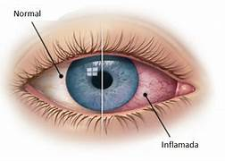

## Conjuntivites Infecciosas

A conjuntivite é uma inflamação da membrana fina e transparente que reveste a parte interna das pálpebras e a superfície branca do olho, conhecida como conjuntiva. Essa condição pode ser causada por diversos fatores, sendo as conjuntivites infecciosas uma das principais categorias. Entre elas, destacam-se a conjuntivite viral e bacteriana cada uma com características distintas.

Anatomia do olho com destaque para a conjuntiva

Esse tipo de conjuntivite tem como causa um micro organismo que está se proliferando, diferentemente da conjuntivite alérgica, que descreveremos em outro artigo.
Click nesse link se quiser saber mais sobre conjuntivites alérgicas.

Conjuntiva normal à esquerda e inflamada à direita

Vamos descrever as diferenças entre tipos de agentes infecciosos: bactérias e vírus. Durante a consulta, tentamos diferenciar qual deles está causando a infecção, mas, nesse ponto, gosto de chamar a atenção que nem sempre é possível diferenciar com 100% de precisão, especialmente quando o paciente vai ao consultório nos primeiros dias de sintomas. Portanto, se a evolução da conjuntivite não esteja sendo conforme esperado, não hesite em entrar em contato e agendar uma reavaliação.

**1. Conjuntivite Bacteriana:**

- **Causa:** Bactérias , tais como Streptococcus e Staphylococcus.
- **Sintomas:** Olhos vermelhos, secreção purulenta, coceira e inchaço das pálpebras. A secreção mais abundante é um dos principais diferenciais desse tipo de conjuntivite.
- **Transmissão:** Contato direto com secreções oculares ou objetos contaminados.
- **Tratamento:** Antibióticos tópicos em colírios são frequentemente prescritos para combater a infecção bacteriana e muitas vezes utilizamos antibióticos associados a anti inflamatórios. Lavagem cuidadosa dos olhos é crucial.

Conjuntivite bacteriana com sua secreção mais purulenta

**2. Conjuntivite Viral:**

- **Causa:** Geralmente provocada por vírus sendo o adenovírus o mais comum. Os vírus são responsáveis por cerca de 90% das conjuntivites infecciosas.
- **Sintomas:** Olhos vermelhos, lacrimejamento, sensação de corpo estranho e sensibilidade à luz. Geralmente o olho amanhece grudado com secreção, mas a secreção costuma ser mais mucoide enquanto a conjuntivite bacteriana é mais purulenta. Pode haver inchaço nas pálpebras.
- **Transmissão:** Contato direto com secreções oculares ou superfícies contaminadas. Essa conjuntivite é aquela que se espalha rápido, em surtos nas escolas e locais de trabalho e, por isso,  é importante afastar as pessoas contaminadas do convívio com seus colegas, para evitar disseminação.  
-

Costumo brincar com meus pacientes que o afastamento não é uma mini férias e nada adianta você se afastar do trabalho ou escola se continuar convivendo com as outras pessoas em casa, no comércio ou clubes. O isolamento é necessário e a pandemia pelo coronavírus ensinou isso bastante para todos. Além disso, oriento que, se os sintomas forem leves, o paciente pode realizar trabalhos em home office.

- **Tratamento:** Repouso, compressas frias e colírios lubrificantes. Antibióticos não são eficazes contra vírus, portanto, o tratamento visa aliviar os sintomas.

Nessa parte é comum o paciente se frustrar durante a consulta, pois todos queremos aquele tratamento mágico que vai fazer com que os sintomas desapareçam imediatamente. É importante enfatizar que não existe um tratamento específico para a conjuntivite viral. É preciso dar tempo para que seu corpo possa produzir anticorpos para a melhora da infecção. A quantidade de dias de infecção pode variar muito, mas em geral os sintomas tendem a piorar nos primeiros 3 a 5 dias, tendem a sumir em 7 a 10 dias, embora em alguns raros casos os sintomas possam durar mais que um mês.

A conjuntivite viral se assemelha muito a uma gripe ou resfriado. Inclusive é comum que o paciente tenha as duas coisas ao mesmo tempo causados pelo mesmo vírus. Claro que é um pouco desanimador  para o paciente ir a um médico esperando um tratamento e ser informado de que é preciso apenas aguardar seu organismo responder, mas é preciso entender que isso é bastante comum nas doenças auto limitadas. Até que apareça uma droga capaz de diminuir o tempo de infecção de uma forma segura, aguardar seu organismo responder é o melhor remédio. Finalmente, para chegarmos à conclusão de que é uma virose, avaliamos vários parâmetros dos seus olhos para excluir outras doenças oculares mais graves, por isso a consulta é tão importante.

Sobre a auto medicação nas conjuntivites, muitos pacientes vem ao consultório usando colírios à base de nafazolina (denominados de colírios comuns) e esses colírios não devem ser usados, pois causam contração dos vasos sanguíneos, dificultando a chegada dos anticorpos e atrapalhando seu sistema de defesa (além de poderem causar efeitos colaterais).
Outro colírio muito comum do paciente chegar usando é o colírio de associação de antibiótico + anti inflamatório. Embora sua venda só seja permitida com retenção de receita médica, sabemos o quanto é fácil para o paciente adquirir esse colírio. Como visto antes, esse tipo de colírio é útil na conjuntivite bacteriana, mas pouco útil ou até prejudicial nas conjuntivites virais. Explico: o antibiótico não vai ter nenhuma ação sobre os vírus (você estará jogando seu dinheiro fora e aumentando o risco de efeitos colaterais que ocorrem em qualquer medicamento; sobre os anti inflamatórios, apesar deles ajudarem a diminuir um pouco os sintomas, os estudos já comprovaram que eles aumentam o tempo da doença. Assim, se sua conjuntivite viral fosse durar 5 dias, talvez ela se estenda até 7 ou 10 dias usando esses colírios. Outro problema dessa classe de medicamentos é se você estiver com uma conjuntivite herpética (o herpes também é um vírus e pode dar sintomas muito parecidos com a conjuntivite viral por adenovírus), o anti inflamatório vai piorar sua doença. Por isso a auto medicação é tão prejudicial e quando algum paciente nos liga ou manda whatsapp querendo que passemos  algum colírio sem ver o paciente, temos que ser dizer que não podemos, para não correr o risco de prejudicar o paciente.

Conjuntivite viral com secreção mais mucóide

# Prevenção

A prevenção da transmissão da conjuntivite envolve práticas de higiene pessoal e medidas para evitar a propagação do vírus ou bactéria causadora da infecção. Aqui estão algumas dicas importantes:

1. **Lavagem das Mãos:**

    - Lave as mãos frequentemente com água e sabão, especialmente após tocar nos olhos ou áreas próximas.
    - Use desinfetante para as mãos à base de álcool quando não for possível lavar as mãos.
2. **Evitar Contato com os Olhos:**

    - Evite coçar ou tocar nos olhos com as mãos não lavadas.
    - Evite compartilhar objetos de uso pessoal, como toalhas, lenços e travesseiros.
3. **Higiene Facial Adequada:**

    - Utilize lenços de papel descartáveis ao assoar o nariz e descarte-os imediatamente.
    - Evite tocar o rosto com as mãos sujas.
4. **Limpeza de Superfícies:**

    - Limpe regularmente superfícies tocadas com frequência, como maçanetas, interruptores de luz e telefones, com desinfetante.
5. **Evitar Contato Próximo com Pessoas Infectadas:**

    - Evite o contato próximo com indivíduos que tenham conjuntivite ou apresentem sintomas oculares.
    - Se você for a pessoa infectada ou suspeita, evite apertos de mãos, abraços ou beijos para evitar a disseminação.
6. **Proteção Pessoal:**

    - Ao participar de atividades esportivas em equipe, evite compartilhar objetos pessoais, como óculos de natação ou equipamentos de proteção.
7. **Cuidados no Ambiente de Trabalho e Escola:**

    - Se estiver com conjuntivite, evite frequentar o trabalho ou a escola até que os sintomas melhorem para reduzir o risco de propagação.

  
  
    

 **Veja também**  

  [Como escolher a lente intraocular](/lentes)  

  [Catarata e Cirurgia de Catarata](/catarata-cirurgia)

  [⇦ voltar a pagina principal](/)

----------------------------------------------------------------------------------------------------
