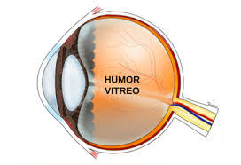
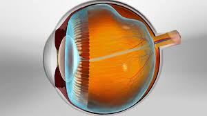
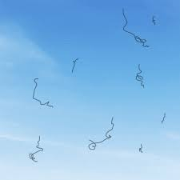
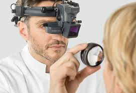
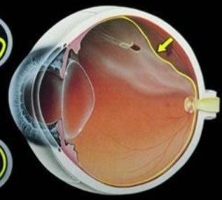
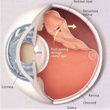
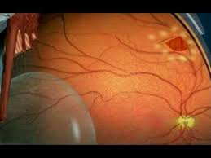
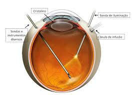

## 👁️ Descolamento de Vítreo e "Moscas Volantes"

<figure>
  
</figure>

Uma queixa muito comum no consultório é o aparecimento súbito de manchas no campo de visão do paciente e ele é causado, na maioria das vezes, pelo descolamento do gel vítreo. 

O descolamento de vítreo é uma condição ocular comum, geralmente fisiológica, especialmente em adultos acima dos 40–50 anos. Embora na maioria das vezes seja benigno e parte do envelhecimento natural do olho, ele pode gerar sintomas perceptíveis e merece atenção adequada para evitar complicações.

## 📖 O que é o humor vítreo e o descolamento

O humor vítreo é uma substância gelatinosa e transparente que preenche o interior do olho e fica aderido à retina no olho jovem e saudável. 

<figure>
  
</figure>

 Com o passar dos anos, essa substância perde parte de sua consistência gelatinosa e se liquefaz. Quando isso acontece, o vítreo pode desprender-se da retina, caracterizando o descolamento de vítreo posterior.

<figure>
  
</figure>

Esse fenômeno pode ocorrer em um ou ambos os olhos ao longo da vida adulta e não é necessariamente uma doença — é uma mudança natural associada ao envelhecimento ocular. Ou seja, não existe nenhum problema no fato do gel vítreo se descolar da retina. O que não pode se descolar é a própria retina (vamos entender ao longo do texto o que pode nos preocupar). 

## 🧠 Causas e fatores de risco

A principal causa é, de fato, o envelhecimento do vítreo e sua progressiva liquefação.

Outros fatores que podem favorecer ou antecipar o descolamento incluem:

-   📏 Miopia (principalmente em graus mais altos)
-   🤕 Trauma ocular (impacto direto no olho)
-   👁️ Inflamações intraoculares (como uveíte)
-   ✂️ Cirurgias oculares recentes, incluindo cirurgia de catarata

Pacientes que já tiveram descolamento de vítreo em um olho também têm maior chance de desenvolvê-lo no outro ao longo do tempo.

## 😣 Como o descolamento de vítreo se manifesta (sintomas)

Quando o vítreo se separa da retina, muitas vezes os sintomas podem ser percebidos pelos próprios pacientes. Entre os sinais mais comuns estão:

-   🪰 Moscas volantes (floaters): pontos, linhas ou formas que se movem no campo de visão
-   ✨ Flashes de luz (fotopsias), especialmente no campo periférico
-   👀 Sensação transitória de sombra ou leve distorção visual em casos associados a tração retiniana

  
<figure>
  
</figure>
  

Muitas pessoas experimentam apenas alguns sintomas leves que melhoram com o tempo à medida que o cérebro se adapta, e a maioria dos casos não compromete diretamente a visão central.

## 📈 Diagnóstico e acompanhamento

<figure>
  
</figure>

O diagnóstico é feito por meio do exame oftalmológico com pupila dilatada, que permite ao oftalmologista observar a retina e verificar a posição do vítreo. Exames complementares, como OCT (Tomografia de Coerência Óptica) ou ultrassonografia ocular, podem ser utilizados, especialmente se houver opacidades ou sintomas incomuns.

Mesmo quando o descolamento de vítreo é benigno, o acompanhamento é importante para monitorar possíveis alterações na retina, como rasgos ou tração anormal — que podem evoluir para condições mais sérias se não forem reconhecidos a tempo.

## ⚠️ Possíveis complicações

Na maioria dos casos, o descolamento de vítreo é inofensivo e não requer tratamento específico. No entanto, em uma parcela menor dos casos, ele pode causar:

🔹

Rasgaduras ou buracos na retina

  
<figure>
  
</figure>
  

Quando o vítreo puxa com força a retina, podem surgir rasgos que permitem que o fluido se infiltre sob a retina, aumentando o risco de descolamento de retina, que é uma emergência oftalmológica.

🔹

Descolamento de retina

  
<figure>
  
</figure>

Essa é uma complicação grave que pode levar à perda irreversível da visão se não for tratada rapidamente.

Em caso de aumento súbito de moscas volantes, flashes intensos ou perda de parte do campo visual, a orientação é procurar atendimento oftalmológico com urgência, pois esses sinais podem indicar uma complicação retiniana.

## 💊 Tratamento

🟢 Quando não há complicações

Na enorme maioria dos casos de descolamento de vítreo sem sinais de rasgo ou tração retiniana, não é necessário tratamento específico.

Os sintomas tendem a diminuir com o tempo, geralmente ao longo de semanas a alguns meses, conforme o cérebro se adapta à mudança estrutural no olho.

🔴 Tratamento de complicações

Se houver rasgos retinianos, o oftalmologista pode realizar:

-   Fotocoagulação a laser para selar os rasgos e reduzir o risco de descolamento de retina;

<figure>
  
</figure>

-   Retinopexia pneumática ou cirurgia vítreo-retiniana, quando indicada, em casos de descolamento de retina emergencial.

<figure>
  
</figure>

 

## 🛡️ Prognóstico e cuidados

O prognóstico para a maioria dos pacientes é excelente, pois o descolamento de vítreo em si geralmente não ameaça a visão. O importante é:

-   Realizar consultas oftalmológicas regulares
-   Procurar atendimento se surgirem novos sintomas (flashes, aumento de moscas volantes, perda de visão)
-   Relatar ao médico qualquer alteração súbita da visão

Essas ações permitem identificar precocemente qualquer complicação retiniana e tratar de forma eficaz.

## 💬 Conclusão

O descolamento de vítreo é um processo comum e frequentemente benigno que acompanha o envelhecimento ocular, podendo ser percebido como moscas volantes ou flashes de luz.

Na maioria dos casos, não exige tratamento específico, mas merece avaliação oftalmológica para afastar complicações importantes, como rasgos ou descolamento de retina — situações que requerem intervenção urgente.

Se você notar sintomas novos ou intensificados, agende uma avaliação com um oftalmologista — cuidados precoces preservam a saúde da sua visão.  
