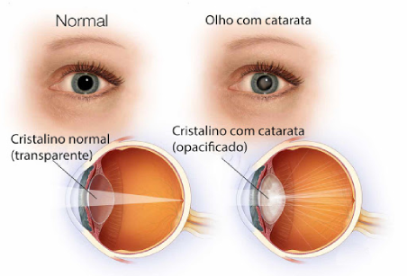
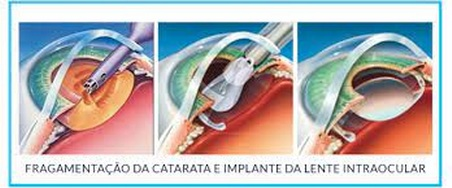

A catarata é um processo de opacificação do cristalino, que é nossa lente natural que fica dentro dos olhos. Essa lente (cristalino) é normalmente clara e transparente. Com o aparecimento da catarata, ela se torna opaca e impede a passagem dos raios luminosos que formam a imagem no fundo do olho. 
A causa mais comum de catarata é o envelhecimento (quanto maior a idade, maior a probabilidade de aparecimento da catarata). Outras causas de catarata são: traumas (acidentes), doenças sistêmicas (como diabetes), uso de medicamentos (especialmente corticoides), catarata congênita (quando uma criança já nasce com catarata), entre outros. 

Essa imagem mostra um olho sem catarata (à esquerda) e um olho com catarata (à direita)  

​

Imagem demonstrando a visão normal de um paciente sem catarata (à esquerda) e a visão turva de um paciente com catarata (à direita)

O tratamento da catarata é cirúrgico. A cirurgia consiste em substituir a lente natural do olho por uma lente intraocular a ser implantada. 
 Importante ressaltar que, até o presente momento, não existem outras formas de tratamento da catarata que não seja cirúrgico. Existem terapias com colírios em pesquisa, mas nada que já esteja aprovado para uso (tenha muito cuidado com terapias não aprovadas que são vendidas na internet). 

O procedimento mais moderno usado para remoção da catarata é chamado de facoemulsificação. Neste procedimento, é realizada uma pequena incisão na parte da frente do olho (córnea), onde é introduzida uma caneta de ultrassom que fragmenta a catarata em inúmeros pedaços, permitindo sua aspiração por aquela pequena abertura no olho. Essa abertura é tão pequena que na maioria das vezes nem precisa de pontos (suturas) para ser fechada.
Depois que a catarata é removida, o seu oftalmologista vai implantar uma lente intraocular artificial dentro do olho, no mesmo local onde foi retirada a lente natural danificada. A lente intraocular passa a ser parte permanente do seu olho. Essa lente tem aproximadamente 20-25 graus de poder e seu implante é imprescindível para que a pessoa volte a enxergar. Por isso, a decisão sobre a lente intraocular é muito importante. 
(ao final deste texto, você verá um link com uma explicação pormenorizada sobre os tipos de lentes intraoculares existentes). 

​

Imagem demonstrando a cirurgia de catarata com implante da lente intraocular.

​

#### Quando operar?  
Com o surgimento da doença, a tendência da catarata é evoluir e a visão tende a ficar cada dia mais turva.

​

Visão normal | Visão com catarata inicial | Visão com catarata avançada.

Antigamente, era necessário esperar a catarata ficar "madura", ou seja, avançada, para a realização da cirurgia. Atualmente, com o desenvolvimento de modernas técnicas e aparelhos, a recomendação é que a cirurgia seja indicada nas fases iniciais da catarata, pois o procedimento torna-se muito mais rápido e seguro. Além disso, o tempo de recuperação é menor quando a cirurgia da catarata é realizada nos estágios iniciais. 

Com a modernização da cirurgia de catarata e das lentes intraoculares, os resultados refrativos estão ficando cada vez melhores, ou seja, cada vez mais, os pacientes que se submetem a esse procedimento conseguem ficar mais independentes dos óculos (desde que sejam implantadas as lentes intraoculares mais modernas). Portanto, a partir de 2022, o Conselho Federal de Medicina liberou a realização dessa cirurgia mesmo em pacientes que ainda não tenham uma catarata significativa, desde que se obedeça alguns pré-requisitos: idade maior de 55 anos e grau de hipermetropia acima de 1,5 graus ou miopia elevada. Este procedimento é denominado troca refrativa do cristalino. (https://brascrs.com.br/src/uploads/2022/02/processo-consulta-cfm-no-06-2021-parecer-cfm-no-02-2022-cirurgia-de-troca-de-cristalino-com-finalidade-refrativa-tcr-facorefrativa.pdf)

 
#### Antes da cirurgia 
Na primeira avaliação, quando é feito o diagnóstico da catarata, serão realizados alguns exames em seu olho para que seu oftalmologista tenha uma noção geral sobre a sua saúde ocular. Além disso, serão dadas informações preliminares sobre a cirurgia.
A partir dessa primeira avaliação serão selecionados os exames complementares necessários e os tratamentos que precisam ser realizados antes da cirurgia. Qualquer doença da superfície dos olhos precisa ser tratada previamente, especialmente a doença do olho seco, pois uma superfície ocular saudável é fundamental para a realização do correto cálculo da lente intraocular. 
Também é necessário que você passe por um clínico e/ou cardiologista e faça um risco cirúrgico e anestesiológico (com um anestesista) para aumentar a segurança durante o procedimento.
Na consulta seguinte, serão agendados todos os exames necessários para o cálculo da lente intraocular, serão discutidas de forma detalhada todas as tecnologias disponíveis das lentes intraoculares, além de discutir todos os riscos inerentes ao procedimento cirúrgico. É muito importante que você compareça a essa consulta com um acompanhante de sua total confiança para te ajudar a tomar todas as decisões acerca da cirurgia.
(no final desta página, você encontrará nosso termo cirúrgico de consentimento para cirurgia de catarata)
​
Recuperação da cirurgia

A cirurgia de catarata é um procedimento relativamente rápido, de 10 a 20 minutos, aproximadamente. Isso não quer dizer que ela seja um procedimento simples, pois envolve muito planejamento e tecnologia para que tudo dê certo. Como são necessários alguns procedimentos antes do ato cirúrgico em si (troca de roupas no centro cirúrgico, acesso venoso, anestesia, antissepsia, marcação para lentes, etc, eu oriento aos pacientes e acompanhantes reservar um turno do seu dia para realização da cirurgia. 
Você deve ficar de 1-2 horas conosco no centro cirúrgico e pode ser necessário ficar um pequeno período de tempo descansando na clínica ou hospital antes de ser liberado para casa. É imprescindível ter um acompanhante para te levar para casa.
Depois da cirurgia, é fundamental que se use os colírios rigorosamente como prescrito pelo seu oftalmologista, para permitir uma recuperação satisfatória.

Durante as primeiras semanas, devem ser evitadas atividades como exercício físico, levantar pesos, abaixar a cabeça. Também é importante que se evite o contato do olho com sujeira, poeira, plantas ou animais, que podem ser fonte de infecção. Atividades corriqueiras como leitura, assistir TV, celular são liberadas imediamente após a cirurgia. 
(uma lista completa das orientações pré e pós operatórias você encontra disponível para download abaixo). 
Aproximadamente um mês após a sua cirurgia, você fará uma consulta de revisão onde será avaliado o resultado final da cirurgia e se tudo tiver acontecido conforme esperado, você receberá alta para continuar sua vida normalmente (ou planejar a cirurgia do segundo olho, caso você só tenha operado o primeiro olho).

Agora que você já entendeu sobre a catarata e seu tratamento, está na hora de visitar nosso link para te ajudar a entender um pouco mais sobre as tecnologias disponíveis para as lentes intraoculares. 

**Veja também**  
 [Comos escolher seus óculos](/dica-oculos)   

[Como escolher a lente intraocular](/dica-lente)

 [⇦ voltar a pagina principal](/)

 ---------------------------------------------------------------------------------------------------