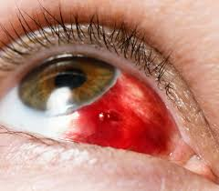
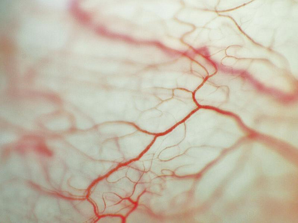
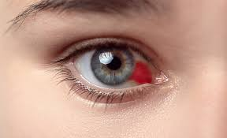
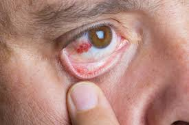

## 👁️ Derrame Ocular ou Hemorragia Subconjuntival ou Hiposfagma

<figure>
  
</figure>

A hemorragia subconjuntival é aquela mancha vermelha intensa que aparece, de repente, na parte branca do olho.

Apesar do aspecto chamativo e assustar bastante os pacientes, na maioria das vezes, é uma condição benigna, indolor e sem risco para a visão.

Ela ocorre quando um pequeno vaso sanguíneo se rompe sob a conjuntiva, espalhando sangue na superfície do olho, de forma semelhante a um “hematoma” na pele.

## 📖 O que é a hemorragia subconjuntival?

A conjuntiva é uma membrana fina e transparente que recobre a parte branca do olho. Ela normalmente possui uma série de vasinhos sanguíneos que normalmente não nos chamam a atenção (exceto quando avaliamos em grandes aumentos como na foto abaixo ou quando há inflamação ocular e os vasos estão dilatados)

<figure>
  
</figure>

Quando algum desses vasos se rompe, por qualquer motivo, o sangue fica preso sob essa membrana, formando a mancha vermelha visível.

<figure>
  
</figure>

Como a conjuntiva não absorve o sangue rapidamente, a mancha pode parecer grande, mas isso não significa que haja sangramento ativo ou dano interno ao olho.

## 🔍 Principais causas

Na maioria dos casos, a hemorragia ocorre por aumento súbito da pressão dentro dos vasos ou trauma direto aos vasos sanguíneos.

Causas mais comuns:
-   Tosse forte
-   Espirros intensos
-   Vômitos
-   Esforço para evacuar
-   Levantar peso
-   Coçar os olhos
-   Pequenos traumas locais

Outras causas associadas:

-   Hipertensão arterial ou picos de pressão elevada
-   Uso de anticoagulantes (como AAS, varfarina, rivaroxabana, entre outros)
-   Distúrbios de coagulação
-   Cirurgias oculares recentes
-   Fragilidade dos vasos em idosos

Na maior parte das vezes, não é possível identificar um fator específico, e o episódio ocorre de forma espontânea.

## 😣 Quais são os sintomas?

<figure>
  
</figure>

A maioria dos pacientes apresenta apenas apenas a mancha vermelha no olho. Geralmente não há dor, não há secreção e não há piora da visão.

Algumas pessoas podem relatar:

-   Leve sensação de peso
-   Pequeno desconforto local

Se houver dor intensa, visão borrada ou sensibilidade importante à luz,  secreção é necessário procurar avaliação oftalmológica imediata, pois pode se tratar de outro tipo de problema ocular.

Uma avaliação oftalmológica completa é recomendada para excluir doenças oculares, conferir a acuidade visual, pressão intra ocular e ter certeza de que não houve hemorragia no interior do globo ocular, pois essas são mais graves e demandam intervenção. No entanto, se não há sinais de alerta acima descritos, você não precisa ir imediatamente e pode agendar uma avaliação.

## 📈 Evolução e tempo de resolução

A hemorragia subconjuntival é autolimitada, ou seja, se resolve sozinha.

O sangue vai sendo absorvido gradualmente pelo organismo, e a mancha muda de coloração, passando por tons de:

-   Vermelho intenso
-   Vinho
-   Amarelado

O desaparecimento completo costuma ocorrer entre 7 e 14 dias, podendo levar um pouco mais em algumas pessoas.

## 💧 Existe tratamento?

Na maioria dos casos, não é necessário nenhum tratamento específico.

O oftalmologista pode indicar colírios lubrificantes, para aliviar possível sensação de irritação

Não existem colírios que “absorvam” o sangue mais rápido.

A reabsorção acontece naturalmente com o tempo.

## ⚠️ Quando é preciso investigar melhor?

A hemorragia subconjuntival costuma ser benigna, mas uma  investigação adicional é recomendada quando:

-   Ocorre repetidamente
-   Surge após trauma significativo
-   Está associada a dor ou visão embaçada
-   O paciente tem histórico de distúrbios de coagulação
-   Há uso de anticoagulantes
-   Há suspeita de hipertensão arterial descontrolada

## 🛡️ Como prevenir novos episódios?

Algumas medidas ajudam a reduzir a chance de recorrência:

-   Evitar coçar os olhos
-   Controlar a pressão arterial
-   Tratar adequadamente a tosse crônica
-   Evitar esforço excessivo ao evacuar
-   Usar colírios lubrificantes se houver olho seco
-   Acompanhar corretamente uso de anticoagulantes

Embora nem sempre seja possível prevenir totalmente, o controle dos fatores de risco reduz bastante a recorrência.

 
## ✅ Conclusão

A hemorragia subconjuntival é uma condição comum e, na maioria das vezes, benigna e sem impacto na visão.

Apesar do aspecto assustador, costuma desaparecer sozinha em poucos dias, sem necessidade de tratamento específico.

Mesmo assim, a avaliação oftalmológica é importante para:

-   Confirmar o diagnóstico
-   Excluir outras causas
-   Identificar fatores de risco, especialmente em casos repetidos

Se você perceber manchas vermelhas recorrentes nos olhos ou associadas a outros sintomas, procure seu oftalmologista para uma avaliação adequada. 
