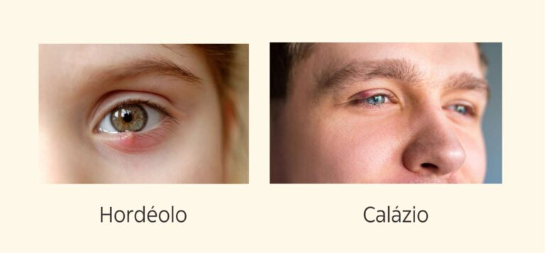
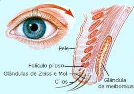
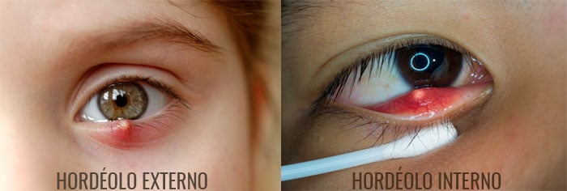
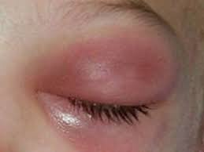
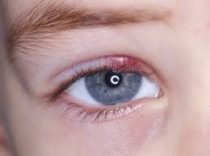
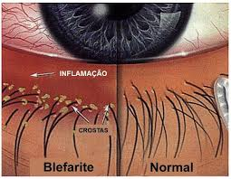

---
slug: "/hordeolo-calazio"
title: "Hordéolo e Calázio"
---

## Entenda as causas, diferenças e como cuidar

É comum aparecer um pequeno caroço na pálpebra, causando incômodo, inchaço ou dor.  

Na maioria das vezes, trata-se de **hordéolo (terçol)** ou **calázio**, duas condições diferentes que podem parecer semelhantes.  

<figure>
  
  <figcaption><em>Imagem mostrando as lesões palpebrais que se confundem no dia a dia.</em></figcaption>
</figure>

A seguir, explicamos o que cada uma significa, como tratar e como prevenir.

<figure>
  
  <figcaption><em>Anatomia das pálpebras mostrando as glândulas externas e internas</em></figcaption>
</figure>

----------

## 🔹 O que é o Hordéolo (Terçol)?

O **hordéolo** é uma **infecção aguda das glândulas da pálpebra**, geralmente causada por bactérias da própria pele, como o _Staphylococcus aureus_.  

Ele surge de forma **repentina**, e costuma provocar **vermelhidão, dor e sensibilidade local** — lembrando uma “espinha” na borda da pálpebra.

O hordéolo pode aparecer **na parte externa** (na borda da pálpebra) ou **interna** (voltada para o globo ocular).  

<figure>
  
  <figcaption><em>O hordéolo pode ocorrer tanto nas glândulas externas quanto interna das pálpebras</em></figcaption>
</figure>

### **Sintomas do Hordéolo**

- Inchaço e vermelhidão na pálpebra

- Dor e sensibilidade ao toque

- Pequeno ponto amarelado (pus), que pode não estar presente nas fases iniciais

- Lacrimejamento e sensação de corpo estranho

- Às vezes, leve desconforto ao piscar

Quando não tratado adequadamente, pode evoluir para um **calázio** ou, em casos mais graves, causar **celulite periorbitária** — uma infecção mais profunda da pálpebra e tecidos ao redor do olho, que pode ser mais grave, especialmente em crianças pequenas. Nestes casos é necessário uso de antibiótico oral ou venoso.

<figure>
  
  <figcaption><em>Imagem de uma celulite periocular</em></figcaption>
</figure>

----------

## 💊 Tratamento do Hordéolo

A maioria dos casos melhora em poucos dias, a própria defesa do organismo se responsabiliza por eliminar o processo infeccioso.

É importante **não espremer** o hordéolo, pois isso pode **espalhar a infecção**, inclusive para regiões mais profundas, o que raramente pode causar **infecção grave nos tecidos orbitários ou até no sistema nervoso central**.

### **Cuidados recomendados**

- **Compressas mornas:** aplicar por 5 a 10 minutos, 3 a 4 vezes ao dia, ajuda a aliviar a dor e facilitar a drenagem.

- **Higiene das pálpebras:** utilizar xampu neutro diluído ou produtos específicos para limpeza palpebral.

- **Evitar maquiagem ou lentes de contato** até o desaparecimento da infecção.

- Se houver secreção intensa, febre local ou o caroço aumentar, o oftalmologista pode indicar **pomadas antibióticas ou colírios**.

- Nos casos com sinais de celulite (inchaço acentuado, vermelhidão que se espalha, dor forte ou febre), é fundamental procurar atendimento médico **imediato**.

----------

## 🔹 O que é o Calázio?

O **calázio** é uma **inflamação crônica, não infecciosa**, causada pela **obstrução das glândulas de Meibômio**, responsáveis por secretar a gordura que compõe a camada protetora das lágrimas.  
Diferente do hordéolo, o calázio **não é uma infecção bacteriana** e geralmente **não causa dor**.

<figure>
  
</figure>

### **Sintomas do Calázio**

- Caroço arredondado e indolor na pálpebra

- Crescimento lento

- Sensação de peso ou leve desconforto estético

- Em casos maiores, pode pressionar o globo ocular e causar leve embaçamento visual

O calázio pode surgir **após um hordéolo que não drenou completamente**.  

Embora seja uma inflamação benigna, pode se tornar incômoda e persistir por semanas ou meses.

----------

## 💊 Tratamento do Calázio

Na maioria das vezes, o calázio **melhora espontaneamente** com medidas simples de calor e massagem.  

Mas se o nódulo persistir, o oftalmologista pode indicar outras opções.

### **Cuidados recomendados**

- **Compressas mornas:** ajudam a amolecer a secreção retida e desobstruir a glândula.

- **Massagem palpebral suave:** após a compressa, massagear delicadamente a pálpebra no sentido da borda (de cima para baixo na pálpebra superior, e de baixo para cima na inferior).

- **Pomadas anti-inflamatórias ou corticoides tópicos:** podem ser prescritas para reduzir a inflamação.

- **Injeção de corticoide local** (em casos selecionados).

- **Cirurgia ambulatorial:** indicada quando o calázio persiste por mais de 4 a 6 semanas ou causa desconforto estético. É um procedimento rápido, feito com anestesia local e recuperação simples.

----------

## 💧 Medidas de Higiene e Prevenção (para ambos)

Tanto o hordéolo quanto o calázio estão relacionados à **oleosidade e inflamação das glândulas das pálpebras** que pode cronicamente obstruir o duto das glandulas.  

<figure>
  
  <figcaption><em>Alguns hábitos simples podem reduzir muito o risco de recorrência:</em></figcaption>
</figure>

### **Cuidados importantes**

- Lave as mãos antes de tocar nos olhos.

- Mantenha **higiene palpebral diária**, especialmente se houver tendência a blefarite.

- **Evite coçar os olhos** ou manipular caroços e secreções.

- Retire completamente a **maquiagem** antes de dormir.

- Troque regularmente **toalhas, fronhas e cosméticos** usados na região ocular.

    Embora esse tratamento não vá curar o processo atual, ele vai te ajudar na prevenção de novas lesões.

----------

## 👨‍⚕️ Quando procurar o oftalmologista

Procure atendimento médico se:

- O inchaço for muito dolorido ou se espalhar rapidamente;

- O caroço não melhorar após 7 dias de compressas;

- Houver secreção abundante, febre ou vermelhidão intensa;

- O problema se repetir com frequência.

O oftalmologista poderá orientar o melhor tratamento e prevenir complicações.

----------

## 🌟 Em resumo

- **Hordéolo (terçol)** → infecção aguda, dolorosa e rápida.

- **Calázio** → inflamação crônica, firme e indolor.

- Ambos exigem **cuidados locais e higiene palpebral** para evitar recidivas.

- **Jamais esprema o hordéolo** — isso pode agravar a infecção.

Cuidar bem das pálpebras é essencial para manter os olhos saudáveis e livres de inflamações. 👁️💙

  
  
    

 **Veja também**  

  [Como escolher a lente intraocular](/lentes)  

  [Catarata e Cirurgia de Catarata](/catarata-cirurgia)

  [⇦ voltar a pagina principal](/)

----------------------------------------------------------------------------------------------------
