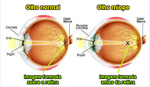
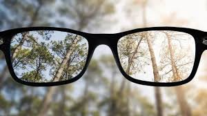
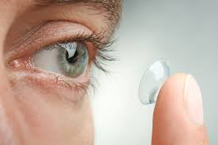
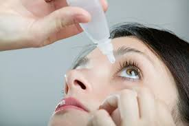
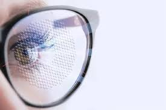
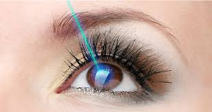

A **miopia** é uma das alterações visuais mais comuns em todo o mundo — e vem crescendo de forma acelerada, especialmente entre crianças e adolescentes.  
  
Quem tem miopia enxerga **bem de perto**, mas os **objetos distantes ficam embaçados**.  

Isso acontece porque o **olho é ligeiramente mais longo** ou a **córnea é mais curva do que o normal**, fazendo com que a imagem se forme **à frente da retina**, em vez de sobre ela.

Nos dias de hoje estamos observando uma epidemia da miopia associado aos hábitos da vida moderna relacionados ao excesso de telas, luzes artificiais e pouco tempo de exposição à luz natural.

----------

----------

## 📈 **Como a miopia evolui**

A miopia geralmente surge **na infância ou adolescência** e tende a **aumentar conforme o crescimento do corpo**.  

Na maioria dos casos, estabiliza **por volta dos 18 a 21 anos**, mas em alguns pode continuar progredindo lentamente na vida adulta.

Quanto mais cedo começa, **maior o risco de graus elevados**, que podem estar associados a complicações como **descolamento de retina, glaucoma e degeneração miópica**.  

Por isso, **consultas regulares** são essenciais já que nos dias de hoje é existem tratamentos para tentar conter o avanço da miopia.

----------

## 👓 **Correção da visão durante a fase de crescimento**

Enquanto a miopia ainda está mudando, é importante garantir **boa visão** sem deixar de **controlar sua progressão**.

### 👓 **Óculos**

São a forma mais prática e segura de correção.  

Podem ser usados o tempo todo ou apenas para atividades que exigem visão de longe (como assistir aula, dirigir, ver TV).

### 👁️ **Lentes de contato**

Oferecem conforto e liberdade visual, especialmente em graus mais altos.  

Hoje existem **lentes de contato com tecnologia de defocus periférico**, que ajudam a **corrigir e controlar o avanço da miopia** ao mesmo tempo.

É importante salientar que o uso das lentes de contato nos adolescentes não é meramente estético. Muitas vezes eles vão oferecer o conforto necessário para que o paciente continue desenvolvendo suas aptidões esportivas facilitando as medidas comportamentais para o controle da miopia. Além disso, favorecem a auto estima, que é fundamental nessa fase da vida.

----------

## 🌤️ **Hábitos que fazem diferença**

Pequenas mudanças no dia a dia podem proteger a visão e retardar a progressão da miopia. São hábitos fundamentais para os pacientes já com diagnóstico de miopia, para aqueles com histórico familiar de miopia, mas também valem para todos os pacientes em geral.

- ☀️ **Passe mais tempo ao ar livre:**  os estudos atuais sugerem que passar pelo menos 2 horas por dia com luz natural favorece um crescimento saudável do globo ocular, diminuindo a progressão da miopia.

- 📵 **Menos telas, mais pausas:** evite uso prolongado de eletrônicos. Quanto mais horas de telas, maior chance de evolução da miopia.

- 💡 **Ambientes bem iluminados** para leitura e estudo, especialmente luz natural.

- 😴 **Sono adequado**, essencial para o crescimento saudável.

É fundamental que as crianças e adolescentes sejam incentivados à prática esportiva, pois é a melhor e mais saudável forma de aderir esses hábitos.

Muito importante também é o envolvimento da família nesse processo. Se a família cria bons hábitos, pratica  esportes juntos, a chance de adesão aumenta ainda mais.

## 💧 **Tratamentos que ajudam a frear a progressão**

A medicina moderna oferece terapias eficazes para **diminuir a velocidade de aumento do grau**, especialmente durante a infância e adolescência.

Antigamente os oftalmologistas apenas corrigiam o grau a cada consulta. Hoje podemos estimar a taxa de crescimento da miopia e tentar intervir quando essa taxa ultrapassa limites determinados. Os estudos mostram que esse tratamento tende a diminuir o grau final do paciente na vida adulta.

Lembrando que o uso desses tratamentos não substitui as medidas de comportamento sugeridas anteriormente.

### 🔹 **Atropina em baixa dose**

Colírios de **atropina diluída (0,01% a 0,05%)** são considerados seguros e ajudam a controlar o crescimento do olho.  

Devem ser usados sob prescrição e acompanhamento oftalmológico.

### 🔹 **Lentes de defocus**

Essas lentes (óculos ou lentes de contato) criam um foco periférico controlado, que reduz o estímulo de alongamento ocular.  

Muitas vezes são **combinadas à atropina** para potencializar os resultados.

   

----------

## 🔍 **E depois que a miopia estabiliza?**

Quando o grau **não muda há pelo menos 1 ou 2 anos**, é possível considerar **opções cirúrgicas** para correção definitiva da visão.  

As principais são:

### 🔸 **Cirurgia a laser (LASIK, PRK ou SMILE)**

Remodela a córnea para que a luz volte a ser focada corretamente sobre a retina.  
É a técnica mais comum para **miopias leves a moderadas**.

### 🔸 **Lente intraocular fácica (LIO fácica)**

Indicada para **graus altos** ou quando a córnea é fina.  
Uma lente é implantada dentro do olho, **sem remover o cristalino natural** — funcionando como uma “lente de contato interna”.

### 🔸 **Anel intracorneano (anel de Ferrara ou HM)**

Implantado dentro da córnea, pode **melhorar a qualidade óptica** e ajudar em casos selecionados em que a córnea é muito fina ou a aplicação do laser não pode ser realizada.

### 🔸 **Faco refrativa (troca do cristalino)**

Indicada para **pacientes mais velhos ou com sinais de catarata inicial**, substituindo o cristalino (lente natural do olho) por uma lente intraocular que corrige o grau.

Cada caso é avaliado individualmente, levando em conta **idade, espessura da córnea, estabilidade do grau e estilo de vida**. Se quiser saber um pouco mais sobre os tratamentos de correção, [clique nesse link](/cirurgia-refrativa/).

----------

## 🌱 **Pré-miopia: um novo conceito**

Um novo conceito  denominado pré miopia vem sendo difundido na oftalmopediatria nos últimos tempos.

Antes que a miopia se instale totalmente, algumas crianças passam pela chamada **pré-miopia** — uma fase em que o olho já começa a alongar, mas ainda não há grau significativo.  Geralmente identificamos e acompanhamos esse processo nos pacientes com histórico familiar de miopia.

Identificar essa fase é muito interessante, pois novos estudos tem sugerido que podemos  **intervir precocemente**, ajudando a **reduzir o risco de progressão**.

O oftalmologista pode detectar essa tendência através de exames como **biometria ocular** e **topografias**, orientando medidas preventivas e comportamentais adequadas.

## 💬 **Conclusão**

A miopia vai muito além de “usar óculos”.  

É uma condição dinâmica que requer **acompanhamento contínuo, hábitos saudáveis e, quando necessário, tratamentos personalizados**.

Do diagnóstico precoce da **pré-miopia** ao controle com **colírios, lentes e cirurgias refrativas**, o objetivo é sempre o mesmo:  
➡️ **manter a visão nítida e preservar a saúde ocular por toda a vida.**

  
  
    

 **Veja também**  

  [Como escolher a lente intraocular](/lentes)  

  [Catarata e Cirurgia de Catarata](/catarata-cirurgia)

  [⇦ voltar a pagina principal](/)

----------------------------------------------------------------------------------------------------
