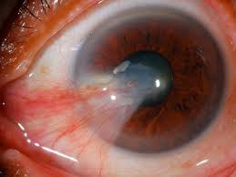
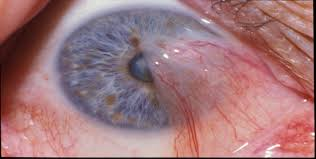
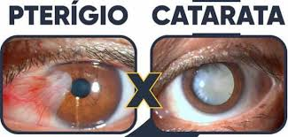
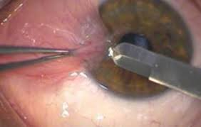

# 👁️ Pterígio																		                  (Carne nos Olhos)

<figure>
  
</figure>

O pterígio, popularmente conhecido como “carne no olho”, é uma alteração ocular comum caracterizada pelo crescimento de um tecido da conjuntiva em direção à córnea.

Apesar de ser uma **lesão benigna**, ele pode causar desconforto, inflamação e, em casos mais avançados, comprometer a visão, podendo ser necessária cirurgia.

## 📖 O que é o pterígio?

<figure>
  
  <figcaption><em>O pterígio é um crescimento  anormal de um tecido fibrovascular que se estende da membrana conjuntiva que recobre a parte branca do olho para a córnea, geralmente pelo lado do nariz.</em></figcaption>
</figure>

Com o tempo, esse tecido pode:

  

-   Alterar a curvatura da córnea
-   Induzir astigmatismo com aparecimento ou mudança do grau do paciente.
-   Causar inflamação e sintomas recorrentes
-   Atingir o eixo visual, reduzindo a acuidade visual

Por se tratar de uma condição progressiva,  deve ser acompanhada pelo oftalmologista.

Obs: muita gente confunde pterigio com catarata, mas elas são duas doenças bem distintas. Enquanto o pterígio é a carne externa ao olho, a catarata é a perda da transparência da lente natural do olho, que fica dentro do olho (por isso a catarata só é visível ao olho nu se estiver muito avançada). 
Se seu interesse é sobre catarata, pode clicar nesse link que te levaremos ao nosso artigo sobre esse tema.

<figure>
  
</figure>

  

  

## 🌞 Etiologia e fatores de risco

O pterígio tem relação com  predisposição genética associada à exposição crônica à radiação ultravioleta (UV).

Por isso quem tem pterígio geralmente conhece algum parente que também tenha. Além disso, existe uma grande quantidade de pacientes com pterígio entre aqueles que trabalham expostos ao sol, como é muito comum nas fazendas em nossa região.

Outros fatores ambientais contribuem para a irritação contínua da superfície ocular.

Fatores de risco mais comuns:

-   ☀️ Exposição solar frequente sem proteção
-   🌬️ Vento, poeira e areia
-   🏗️ Atividades ao ar livre (construção, agricultura, pesca)
-   👁️ Olho seco crônico
-   🌡️ Climas quentes e secos
-   Histórico familiar

Assim, quanto mais exposição ao sol e irritantes oculares, mais inflamado vai ficar seu olho e maior a chance crescimento da lesão.

## 😣 Quais são os sintomas?

Nos estágios iniciais, o pterígio pode não causar sintomas importantes, sendo percebido apenas como uma mancha no olho. Nos casos iniciais, ele é chamado de Pinguécula. 

Com o crescimento, podem surgir:
-   Sensação de areia ou corpo estranho
-   Ardência e vermelhidão
-   Lacrimejamento
-   Coceira
-   Visão embaçada
-   Dificuldade para usar lentes de contato

Quando há alteração significativa da córnea, o paciente pode apresentar queda da qualidade visual.

## 📈 Evolução da doença

O crescimento do pterígio é variável. Alguns permanecem pequenos por anos, enquanto outros podem crescer mais rapidamente.

Na prática clínica, observamos que a progressão está muito relacionada à continuidade da exposição solar e ambiental.

Sem acompanhamento, o pterígio pode:
-   Aumentar o astigmatismo
-   Tornar-se mais inflamado
-   Atingir o centro da córnea
-   Exigir cirurgia em estágios mais avançados

Por isso, mesmo pterígios pequenos devem ser avaliados periodicamente.

## 💧 Tratamento clínico

 
<figure>
  
</figure>

O tratamento clínico não faz a lesão desaparecer, mas ajuda a controlar sintomas e inflamação, sendo muitas vezes suficiente para satisfazer os pacientes nos pterígios pequenos.

Pode incluir:

-   Colírios lubrificantes
-   Colírios anti-inflamatórios em fases de irritação
-   Uso regular de óculos escuros com proteção UV
-   Controle do olho seco

É indicado principalmente quando:

-   O pterígio é pequeno
-   Não há comprometimento visual
-   Os sintomas são leves

<figure>
  
</figure>

## 🔪 Quando a cirurgia é indicada?

  
A cirurgia é indicada quando:

-   Há crescimento progressivo
-   O pterígio causa astigmatismo significativo
-   Aproxima-se ou atinge o eixo visual
-   Há inflamação recorrente apesar do tratamento clínico
-   Existe incômodo estético importante

A decisão é sempre individualizada, após avaliação oftalmológica completa.

## 🩺 Cirurgia de pterígio com autoenxerto conjuntival e cola biológica

<figure>
  
</figure>

Atualmente, a técnica mais utilizada e recomendada é a remoção do pterígio com autoenxerto conjuntival, frequentemente fixado com cola biológica.

É importante ressaltar que essa é nossa técnica de escolha , sendo  a mais moderna atualmente disponível no mundo. Ela possui recuperação mais rápida (por não precisar pontos) e com a menor chance de voltar o pterígio (o que era muito comum no passado, atualmente é bem raro).

Obs: atualmente não existe cirurgia à laser para pterígio. 

Como é realizada:

1.  O pterígio é removido da córnea e da esclera.
2.  Um pequeno fragmento saudável da própria conjuntiva do paciente é retirado (geralmente da parte inferior do olho).
3.  Esse tecido é transplantado para a área operada.
4.  O enxerto é fixado com cola biológica ou, em alguns casos, pontos muito finos.

Vantagens da técnica com cola biológica:

 
-   Menor inflamação pós-operatória
-   Mais conforto
-   Recuperação mais rápida
-   Melhor resultado estético
-   Menor taxa de recidiva em comparação às técnicas antigas

Essa técnica representa hoje o padrão-ouro no tratamento cirúrgico do pterígio.

Com uso da cola a cirurgia se tornou bem rápida (em torno de 10 a 15 minutos), não necessita de internação hospitalar (o paciente é liberado algumas horas após o procedimento) e muitas vezes já liberamos para ir pra casa sem tampão.

Se você tem medo, não se preocupe, podemos realizar sua cirurgia com sedação acompanhado por um anestesiologista.

## 🩹 Cuidados após a cirurgia

A recuperação costuma ser rápida, mas requer atenção aos cuidados

Primeiros dias:

-   Uso correto dos colírios prescritos
-   Evitar coçar o olho
-   Uso de óculos escuros ao sair
-   Evitar poeira e vento

Primeiras semanas:

-   Evitar piscina, praia e maquiagem
-   Não realizar esforço físico intenso
-   Comparecer às consultas de retorno

É comum ocorrer:

-   Vermelhidão
-   Sensação de corpo estranho
-   Leve inchaço

Esses sintomas melhoram gradualmente a recuperação varia de pessoa para pessoa.
  
⚠️ Dor intensa, secreção ou piora súbita da visão exigem avaliação imediata.

## ✅ Conclusão

O pterígio é uma condição comum, especialmente em regiões com alta exposição solar.

Com diagnóstico precoce, proteção adequada e acompanhamento oftalmológico, é possível controlar os sintomas e evitar progressão.

Quando indicada, a cirurgia com autoenxerto conjuntival e cola biológica oferece excelentes resultados visuais e estéticos, com baixos índices de recidiva.

Se você apresenta sintomas ou percebe crescimento de tecido sobre a córnea, uma avaliação oftalmológica é fundamental para definir o melhor momento do tratamento.

   
